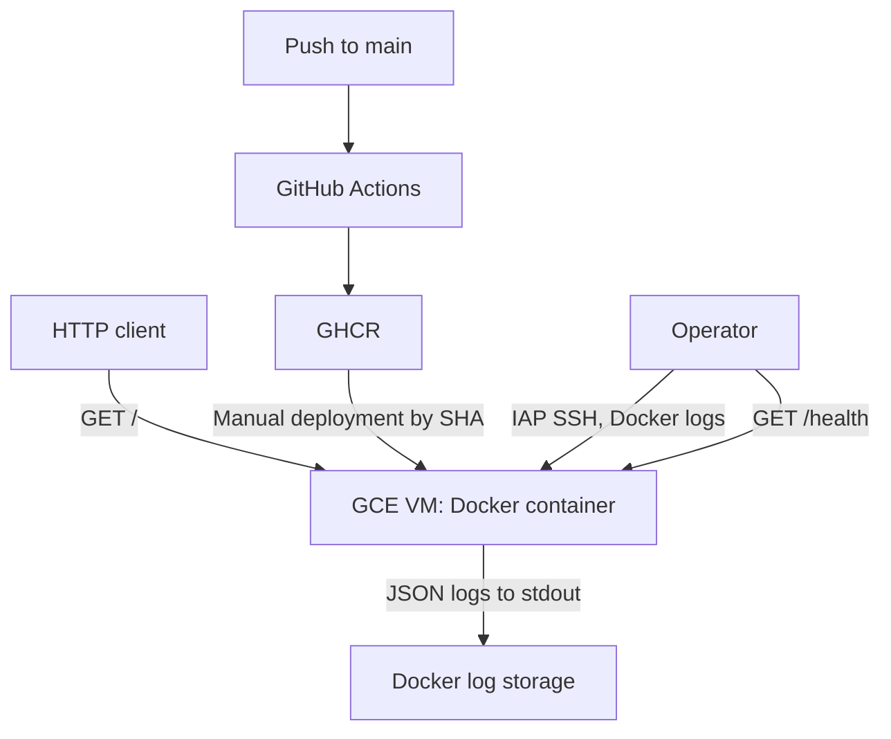

# Small internal platform with running HTTP service for test assignment

## Architecture

Health checks and log inspection are manual.

## Prerequisites
- A Google Cloud project with billing enabled and permission to create Compute Engine, VPC, IAM and Workload Identity resources.
- Terraform and Google Cloud CLI (`gcloud`) installed locally.
- Google Cloud CLI authenticated to the intended project; Terraform must use credentials for that same account.
- Permission to connect to the VM through IAP SSH.
- Docker is required on the VM ans is installed by `terraform/startup.sh`.
- A public GHCR image is available at `ghcr.io/mariiakorsh/msd_test/platform-demo`, tagged with the Git commit SHA.

## Deployment

### Create the infrastructure
Check the active GCP project and credentials before applying Terraform:
```bash
gcloud config get-value project
gcloud auth list
```
Review and create the resources:
```bash
cd terraform
terraform init
terraform plan
terraform apply
```
Review the plan before approving `apply`. Terraform creates the VPC, subnet, firewall rules, service accounts, Workload Identity configuration and VM. The VM startup script installs Docker. Keep the local Terraform state and application default credentials out of Git.

### Deploy an image
*Use this procedure only when no container named platform-demo exists; otherwise use Update an existing deployment.*
After the GitHub Actions `publish` job succeeds, copy the full commit SHA from that run. Run the following commands, replacing `<COMMIT_SHA>`, to connect to the VM and run the Docker image:
```bash
gcloud compute ssh platform-demo-vm --project=msd-test-assignment --zone=us-west1-a --tunnel-through-iap --command='
    set -e
    IMAGE="ghcr.io/mariiakorsh/msd_test/platform-demo:<COMMIT_SHA>"
    sudo docker pull "$IMAGE"
    sudo docker run -d --name platform-demo --restart unless-stopped -p 80:8080 "$IMAGE"
    for attempt in 1 2 3 4 5; do
      if curl -fsS http://127.0.0.1/health; then
        exit 0
      fi
      sleep 2
    done
    exit 1
  '
```
The GHCR package is public, so the VM does not need a GitHub token. The image is selected by its commit SHA.


### Update an existing deployment
After the GitHub Actions `publish` job succeeds, copy the full SHA of the new image. Replace `<NEW_COMMIT_SHA>` in both commands below.

First, run the new image on port 8081, accessible only from the VM. The current service continues to run on port 80:
```bash
gcloud compute ssh platform-demo-vm --project=msd-test-assignment --zone=us-west1-a --tunnel-through-iap --command='
    set -e
    IMAGE="ghcr.io/mariiakorsh/msd_test/platform-demo:<NEW_COMMIT_SHA>"
    sudo docker pull "$IMAGE"
    sudo docker run -d --rm --name platform-demo-candidate \
      -p 127.0.0.1:8081:8080 "$IMAGE"

    for attempt in 1 2 3 4 5; do
      if curl -fsS http://127.0.0.1:8081/health; then
        exit 0
      fi
      sleep 2
    done
    exit 1
  '
```
If the health check fails, keep the current service running on port 80. If platform-demo-candidate is still running, inspect its logs with `sudo docker logs platform-demo-candidate`, then stop it with `sudo docker stop platform-demo-candidate` before retrying. If it already exited, `--rm` has removed the container; inspect the command output and investigate the failure before retrying.

If the candidate is healthy, switch port 80 to the new image:
```bash
gcloud compute ssh platform-demo-vm --project=msd-test-assignment --zone=us-west1-a --tunnel-through-iap --command='
    set -e
    IMAGE="ghcr.io/mariiakorsh/msd_test/platform-demo:<NEW_COMMIT_SHA>"
    sudo docker stop platform-demo-candidate
    sudo docker stop platform-demo
    sudo docker rename platform-demo "platform-demo-previous-$(date +%s)"
    sudo docker run -d --name platform-demo --restart unless-stopped -p 80:8080 "$IMAGE"

    for attempt in 1 2 3 4 5; do
      if curl -fsS http://127.0.0.1/health; then
        exit 0
      fi
      sleep 2
    done
    exit 1
  '
```
The previous container is preserved for rollback. Expect a brief interruption while port 80 moves to the new container. If the final health check fails, follow the Rollback procedure below.

## Validation

Run the checks on the VM through IAP SSH:

```bash
gcloud compute ssh platform-demo-vm --project=msd-test-assignment --zone=us-west1-a --tunnel-through-iap --command='
    set -e
    sudo docker ps --filter name=^/platform-demo$
    curl -fsS http://127.0.0.1/
    curl -fsS http://127.0.0.1/health
    sudo docker logs --tail 20 platform-demo
  '
```

Expected results: the `platform-demo` container is running; `/` returns the service name and version; `/health` returns `{"status":"ok"}`; `docker logs` contains JSON request records with the path, status code and duration.

The service is also exposed on HTTP port 80. Its external IP is ephemeral and may change after the VM is stopped and started.

An operator checks /health and recent Docker logs after every deployment and when the service is reported unavailable. Continuous monitoring and alerts are not implemented; production would need an external uptime check and an alert.

## Rollback

If a new deployment fails its health check, inspect its logs first and choose the last known good image SHA from GHCR. For this demonstration, the previous published SHA is `9263f466bc3131e4d846f1e2c54125a436c2592e` :

```bash
gcloud compute ssh platform-demo-vm --project=msd-test-assignment --zone=us-west1-a --tunnel-through-iap --command='
    set -e
    IMAGE="ghcr.io/mariiakorsh/msd_test/platform-demo:9263f466bc3131e4d846f1e2c54125a436c2592e"
    sudo docker pull "$IMAGE"
    sudo docker logs --tail 30 platform-demo || true
    sudo docker rm -f platform-demo 2>/dev/null || true
    sudo docker run -d --name platform-demo --restart unless-stopped -p 80:8080 "$IMAGE"

    for attempt in 1 2 3 4 5; do
      if curl -fsS http://127.0.0.1/health; then
        exit 0
      fi
      sleep 2
    done
    exit 1
  '
```

This is a manual rollback. The service is briefly unavailable while the container on port 80 is replaced. If the final check fails, inspect `sudo docker ps -a` and `sudo docker logs platform-demo` on the VM.

## Cleanup

From the repository root, review and destroy the Terraform-managed resources:

```bash
cd terraform
terraform plan -destroy
terraform destroy
```

Check the project and the destroy plan before confirming. This removes the VM, its boot disk, the demo VPC and firewall rules, and the IAM resources managed by this Terraform state. Destroying the VM also deletes its containers and local Docker logs. The GitHub repository and GHCR images are separate and remain available.

## Incident runbook

### Service is unhealthy or unavailable

1. Connect through IAP SSH and check the container state, local health endpoint and recent logs:

```bash
gcloud compute ssh platform-demo-vm --project=msd-test-assignment --zone=us-west1-a --tunnel-through-iap --command='
    sudo docker ps -a --filter name=^/platform-demo$
    curl --max-time 5 -i http://127.0.0.1/health
    sudo docker logs --tail 30 platform-demo
  '
```

2. If the container is stopped and the same image was previously healthy, restart it and check `/health` again:

```bash
gcloud compute ssh platform-demo-vm --project=msd-test-assignment --zone=us-west1-a --tunnel-through-iap --command='sudo docker start platform-demo'
gcloud compute ssh platform-demo-vm --project=msd-test-assignment --zone=us-west1-a --tunnel-through-iap --command='
    sudo docker start platform-demo || exit 1
    for attempt in 1 2 3 4 5; do
      if curl -fsS http://127.0.0.1/health; then
        exit 0
      fi
      sleep 2
    done
    exit 1
  '
```

3. If the problem began after a new deployment, follow the **Rollback** procedure instead. If the container is running but remains unhealthy, inspect its logs and the VM's available disk space before changing anything else.

### Reproducible failure demonstration

The `platform-demo` was stopped with `sudo docker stop platform-demo`. On the VM, Docker reported `Exited` and a VM-local request to `127.0.0.1/health` failed to connect. After `sudo docker start platform-demo`, the same endpoint returned HTTP 200. This demonstrates manual detection and recovery; no automatic alert or restart was triggered by the test.


## Operational assumptions and limitations
- This demonstration uses one Debian 12 `e2-micro` VM in `us-west1-a` with a 10 GB standard persistent boot disk. There is no load balancer or high availability.
- GitHub Actions tests the service, builds an image and publishes it to GHCR under the commit SHA. Deployment to the VM and rollback are manual.
- The startup script installs Docker. The application needs no runtime secrets; no GitHub token is stored on the VM.
- HTTP port 80 is public and has no TLS. SSH access is through IAP. Production would require HTTPS and a reviewed access policy.
- `/health` checks that the application responds. JSON request logs are available through `docker logs` on the VM. Health checks and log inspection are manual; there is no automatic alert or central collection of application logs.
- GCP Free Tier covers eligible `e2-micro` usage in `us-west1` and an allowance of standard persistent disk. It does not guarantee a zero bill: the external IPv4 address, usage beyond allowances and network traffic can incur charges. Review Billing while the VM exists and run cleanup when finished.


## Design note

### Availability versus cost

A single `e2-micro` VM keeps the demo small and eligible for the GCP Free Tier compute allowance. It is a single point of failure: stopping or losing the VM makes the service unavailable. A production service would need multiple instances and a load balancer, with higher cost and operational complexity.

### Deployment speed versus control

CI automatically tests and publishes an image tagged with the commit SHA, but an operator chooses when to deploy it. This makes the deployed version explicit and keeps GitHub Actions from having permission to administer the VM. The tradeoff is manual work and a brief interruption when switching port 80. Production would need a controlled deployment workflow with automated health checks and rollback.
